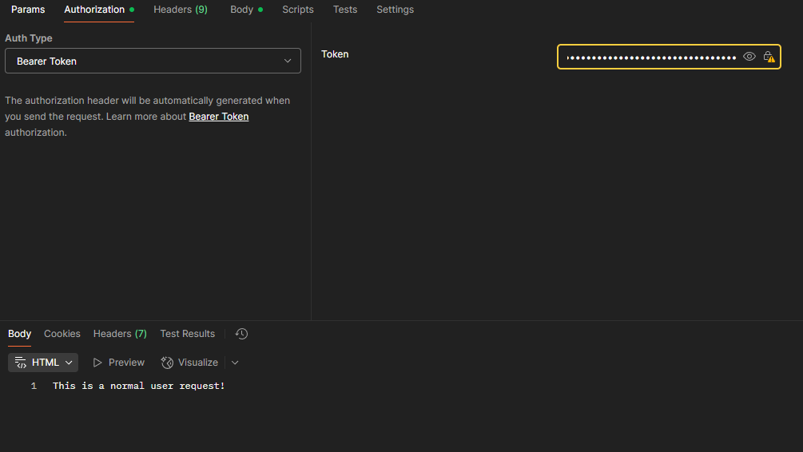

# JWT Authentication API

This is a simple RESTful API built with **Node.js**, **Express**, **Sequelize**, and **PostgreSQL** that implements user registration and login functionality using **JWT (JSON Web Tokens)** for authentication and authorization.

## 🛡️ What is JWT?

JWT (JSON Web Token) is a compact, URL-safe means of representing claims to be transferred between two parties. It's commonly used to:

- Authenticate users after login
- Authorize access to protected routes or resources
- Avoid storing sessions on the server (stateless authentication)

Once a user logs in successfully, the server generates a token signed with a secret key. The client stores this token (typically in localStorage or a cookie) and sends it with each request to access protected resources.

## 🧱 Tech Stack

- **Node.js**
- **Express.js**
- **Sequelize ORM**
- **PostgreSQL**
- **bcryptjs**: Password hashing
- **jsonwebtoken**: JWT token creation and validation
- **dotenv**: Environment variable management

## 🚀 Features

- User registration with hashed passwords
- User login with email and password
- JWT token generation
- Role-based authorization (user or admin)
- Modular architecture (routes, controllers, models)

## 📦 Installation

```bash
git clone https://github.com/tobiasds01/jwt-auth.git
cd jwt-auth-api
npm install
```

## ⚙️ Environment Variables
Create a .env file in the root directory with the following variables:

```env
DB_USERNAME=your_db_user
DB_PASSWORD=your_db_password
DB_NAME=your_db_name
TOKEN_SECRET=your_jwt_secret_key
```

## 🗄️ Database Configuration
You can configure Sequelize in src/config/config.js. Use sequelize-cli to run migrations if needed.

```bash
npx sequelize-cli db:create
npx sequelize-cli db:migrate
```

## 📮 API Endpoints
| Method | Endpoint | Description |
|--------|----------|-------------|
| POST | /sign/register | Register a new user |
| POST | /sign/login | Login and get JWT |
| GET | /user/ | Access protected route (JWT required) |
| GET | /admin/ | Access protected route (JWT required, only ADMIN role) |

## 🔐 Usage Example
After logging in and receiving a token:

#### Request
```sql
GET http://localhost:3000/user/
```

#### Body
```json
{
    "email": "test-email@domain.com",
    "password": "a-password",
    "role": "user"
}
```
**Note:** possible roles: 'user' | 'admin'

#### Authorization Bearer Token
```
The token provided by your login
```




## 📌 License
This project is open-source and available under the MIT License.